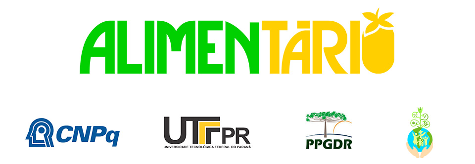

## Alimentário

 **Sistema de Desenvolvimento e Análise de Questionários do GPPADEM (Alimentário)** 

## Instalação


Para instalar o software, Alimentário, no seu computador local rode em um terminal:
```
pip install git+https://github.com/lealdino/alimentario.git
```
### Requisitos

- `Python >= 3`


## Boas vindas ao Alimentário 👋

🙋‍♀️ Comece aprendendo sobre o Software: 

* Manual do Usuário
* Como o Softaware Funciona? 
* [LimeSurvey](https://www.limesurvey.org/)
* [Offline Survey](https://www.offlinesurveys.com/)

🏭 Saiba mais sobre o Projeto de Pesquisa sobre Mercados Alimentares: 

* [Site do Programa de Pós Graduação - GEPPADEM](https://pb.utfpr.edu.br/geppadem/)
* [Site do Projeto - Mercados Alimentares](https://portal.utfpr.edu.br/noticias/pato-branco/mercados-alimentares-digitais-no-brasil)
* [CNPQ](https://www.gov.br/cnpq/pt-br)
* [UTFPR](https://utfpr.gov.br)
* [PPGDR]()
  

## :blue_book: Documentos

* [API de comunicação com o LimeSurvey](https://api.limesurvey.org/classes/remotecontrol_handle.html)


